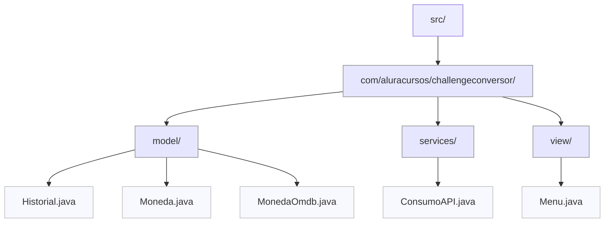

# Conversor de Monedas

Este proyecto es una aplicación de consola en Java que permite convertir entre diferentes monedas utilizando una API de tasas de cambio en tiempo real.

## Características

- Conversión entre las siguientes monedas:
  - Dólar estadounidense (USD)
  - Real brasileño (BRL)
  - Peso argentino (ARS)
  - Peso mexicano (MXN)
  - Peso colombiano (COP)
- Consulta de tasas de cambio actualizadas mediante la API [ExchangeRate-API](https://www.exchangerate-api.com/)
- Historial de conversiones realizadas durante la sesión.
- Interfaz interactiva por consola.

## Estructura del Proyecto



## Dependencias

- [Gson](https://github.com/google/gson) para el manejo de JSON.
- Java 11 o superior (por el uso de `HttpClient`).

## Instalación

1. Clona este repositorio.
2. Descarga la librería Gson y colócala en la carpeta `lib/`.
3. Asegúrate de tener Java instalado y configurado en tu sistema.

## Ejecución

Compila el proyecto:

```sh
javac -cp "lib/gson-2.13.1.jar" -d bin src/App.java src/com/aluracursos/challengeconversor/model/*.java src/com/aluracursos/challengeconversor/services/*.java src/com/aluracursos/challengeconversor/view/*.java
```

Ejecuta la aplicación:

```sh
java -cp "bin;lib/gson-2.13.1.jar" App
```

## Uso

Sigue las instrucciones en consola para seleccionar la moneda, ingresar la cantidad y ver el resultado de la conversión. Puedes consultar el historial de conversiones realizadas durante la sesión.

## Créditos

Desarrollado por Luis Correa.